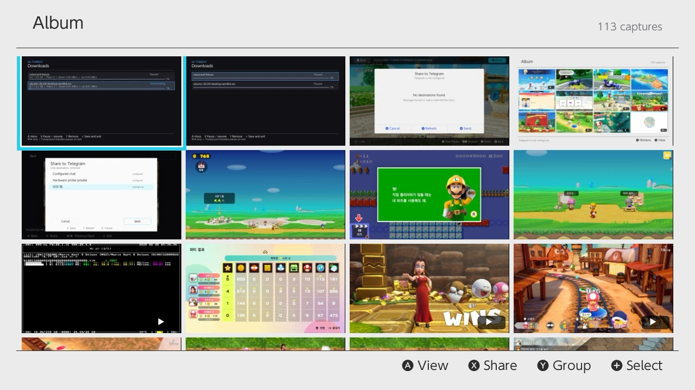
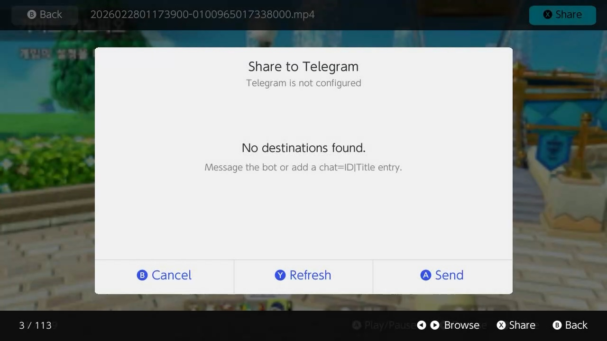

# NX Gallery

NX Gallery is a Nintendo Switch homebrew capture browser inspired by the
console's Album app. Browse screenshots and videos from NAND or SD storage,
play captured videos, and share selected media to Telegram.

**[Download the latest release](https://github.com/LPFchan/nxgallery/releases/latest)**

<p align="center">
  
  
</p>

## Features

- Stock-Album-inspired capture grid and full-screen viewer.
- Read-only access to NAND and SD captures through Horizon Album Accessor.
- Controller-first interface with touch support throughout the main flow.
- H.264 video playback with AAC audio, pause and resume, timeline progress,
  and accelerated right-stick scrubbing with a seek preview.
- Single-capture and ordered multi-select sharing through the Telegram Bot API.
  Larger selections are delivered sequentially in batches of up to ten.
- Local-network QR onboarding, manual bot configuration, and cached Telegram
  destinations.
- Whole-selection transfer progress with cancellation.
- Explicit in-app updates to newer stable releases, with SHA-256 and NRO
  validation before installation.

## Install

You need a Nintendo Switch that can launch homebrew with full memory access.
Telegram sharing also requires network access and a Telegram bot.

1. Download `nxgallery.nro` from the
   [latest release](https://github.com/LPFchan/nxgallery/releases/latest).
2. Copy it to `/switch/nxgallery/nxgallery.nro` on the SD card.
3. Launch NX Gallery through the Homebrew Menu with full memory access.
4. Follow the on-screen setup when prompted to enable Telegram sharing.

## Telegram setup

If no bot token is configured, NX Gallery opens its setup screen on first
launch. Create a bot with Telegram's `@BotFather`, then scan the displayed QR
code with a phone on the same local network as the Switch. The phone opens a
one-time page served by the console where you can submit the token directly to
NX Gallery.

For manual setup, copy
[`telegram-bot.conf.example`](telegram-bot.conf.example) to the SD card as
`/switch/nxgallery/telegram-bot.conf` and replace the placeholder token. Keep
this file private. NX Gallery can also reuse the token from
`/switch/nxtorrent/telegram-bot.conf` when NX Torrent is already configured.

NX Gallery discovers destinations from pending updates received by the bot and
caches them locally. Before refreshing, message the bot directly or add it to
the intended group and send a message there. For a channel, add the bot as an
administrator allowed to post media, then publish a channel post. Open the
Telegram picker and press Y to refresh.

Telegram bots cannot enumerate arbitrary chat history. If a destination is not
available through pending updates, add a `chat=ID|Title` entry to the
configuration file so it always appears.

## Controls

| Screen | Controller | Touch |
| --- | --- | --- |
| Grid | D-pad or left stick navigates; A opens; X shares; Y groups by date; Plus starts or finishes multi-select. In multi-select, A marks captures. | Drag to scroll, tap a capture to open it, or tap the visible View, Share, Group, Select, and Update actions. |
| Viewer | D-pad or left stick changes capture; A plays or pauses video; hold the right stick left or right to preview an accelerated scrub, then release to seek; X shares; B returns. | Swipe horizontally to browse, tap the video to play or pause, or use the visible actions. |
| Chat picker | Up/down selects; A sends; Y refreshes destinations; Plus opens Bot Setup; B closes the picker. | Tap a destination, then use Back, Refresh, or Send. |
| Sending | B requests cancellation. | Tap Cancel. |

## Updates

NX Gallery checks for a newer stable release at startup. When one is available,
a Minus Update action appears on the grid. Press Minus or tap the action to
start the download; updates are never installed without that explicit action.

Before replacing the installed app, NX Gallery verifies the release asset's
GitHub-provided SHA-256 digest and validates the NRO structure. Restart NX
Gallery after a successful update.

## Build

Run the portable host tests with:

```sh
make host-test
```

A Switch build requires devkitA64, staged Plutonium, curl, OpenSSL, and an
FFmpeg 7.1 prefix with H.264 and AAC decoding enabled. The repository includes
[`scripts/build-switch-ffmpeg.sh`](scripts/build-switch-ffmpeg.sh) to create the
playback prefix:

```sh
export DEVKITPRO=/opt/devkitpro
export DEVKITA64="$DEVKITPRO/devkitA64"
export PORTLIBS="$DEVKITPRO/portlibs/switch"
export PLUTONIUM_PREFIX=/path/to/staged/plutonium
export SWITCH_CURL_PREFIX=/path/to/staged/switch-curl
export SWITCH_OPENSSL_PREFIX=/path/to/staged/switch-openssl
export PATH="$DEVKITPRO/tools/bin:$DEVKITA64/bin:$PATH"

scripts/build-switch-ffmpeg.sh \
  /path/to/ffmpeg-7.1 /path/to/ffmpeg-build /path/to/ffmpeg-prefix
export PLAYBACK_PREFIX=/path/to/ffmpeg-prefix

make -j4 APP_VERSION=0.1.6
```

The build rejects a playback prefix that does not register the AAC decoder.
